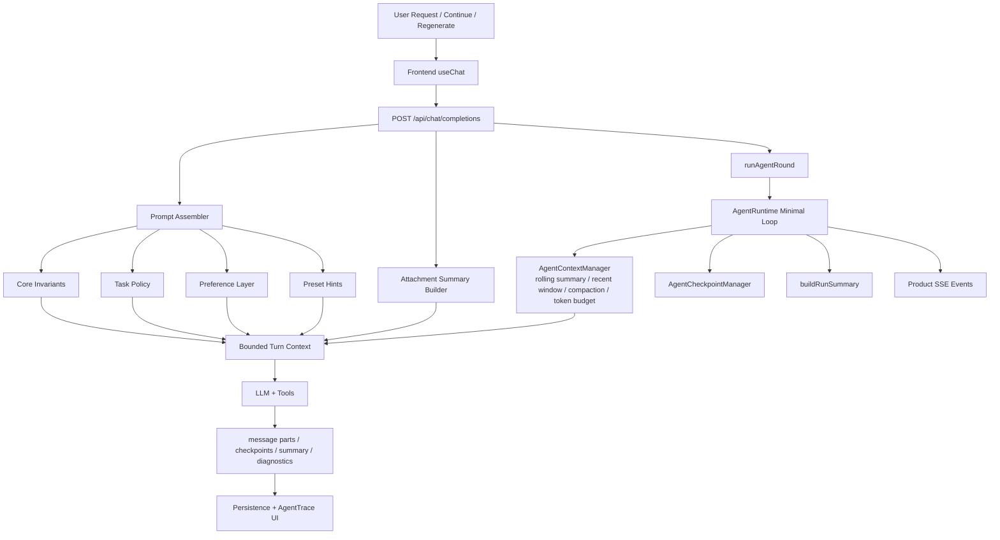

# Qiu 能力架构总览\_0317

本文档用于核对 [`PRD-06_Qiu能力架构重定义_PromptPreset_WorkflowTemplate_Tools_MCP_0311.md`](/Users/staff/Documents/agent-workspace/fullstack/next/QiuChat/docs/prd/PRD-06_Qiu能力架构重定义_PromptPreset_WorkflowTemplate_Tools_MCP_0311.md) 与当前代码实现的一致性。

## 结论

当前实现已经完成能力架构主链路迁移，并在此基础上完成了单 Agent 对话流重构：

- 产品主概念已经切换到 `Prompt Presets / Workflow Templates / Tools / MCP`
- 运行时已经使用 `PromptPresetRegistry + WorkflowTemplateRegistry + Prompt Assembler + ToolRegistry + MCPGateway`
- MCP 已支持 `stdio` 与 `http`
- 模型侧输入已经收敛为“分层 system prompt + bounded messages + attachment summary layer + tool definitions”
- assistant 消息已经升级为“`Agent Trace + Final Answer`”的结构化消息模型
- SSE 已收敛为单一产品事件协议（`agent.* / message.delta / message.done`）
- runtime 已拆成最小单 Agent loop + context/checkpoint/summary 边界

在此基础上，Agent 的上下文组织也已经完成一轮 Attention 优化：

- prompt 已按 `Core Invariants / Task Policy / Memory Context / Preference Layer / Preset Hints` 分层
- runtime 不再在无 summary 时退回全量历史，而是默认构建有限窗口
- session summary 已从“超限后补救”升级为 rolling summary
- 附件默认以独立 `Attachment context layer` 注入，不再挤占 user 正文
- runtime 已按近似 token budget 分配 `system / memory / recent messages / attachments / tool schema`
- 每轮运行都会生成 `contextDiagnostics`，可以解释“为什么这轮上下文是这样构建的”

同时，单 Agent 的产品体验也已经与 runtime 结构重新对齐：

- 用户默认在 assistant 消息内部看到过程展示，而不是依赖旁路面板
- 暂停/失败后的恢复入口统一表达为“继续处理”
- `planner-executor` 不再承载全部上下文治理、checkpoint 与 summary 逻辑
- 恢复运行不再受历史 `checkpoint.steps` 的 loop 配额污染

当前主链路已经完成单轨收敛：前端、SSE、消息 metadata、checkpoint 恢复均以新结构为唯一真源。

## PRD 对照

### 1. Prompt Preset

PRD 要求：

- 角色、风格、领域偏好由 Prompt Preset 承载
- 支持多选叠加

当前实现：

- [`registry.ts`](/Users/staff/Documents/agent-workspace/fullstack/next/QiuChat/src/lib/agent/presets/registry.ts) 提供 builtin、local、custom prompt presets 加载
- 设置页和 `/api/chat/agent-config` 已暴露 `promptPresets`
- 聊天请求与 checkpoint 已落 `promptPresetIds`

结论：已落地。

### 2. Workflow Template

PRD 要求：

- 以任务推进方式为中心
- 一次会话通常只选择一个主模板

当前实现：

- [`registry.ts`](/Users/staff/Documents/agent-workspace/fullstack/next/QiuChat/src/lib/agent/workflows/registry.ts) 提供 workflow templates
- 设置页和 `/api/chat/agent-config` 已暴露 `workflowTemplates`
- 聊天请求支持 `workflowTemplateId`

结论：已落地。

### 3. Prompt Assembler

PRD 要求：

- 将 base prompt、prompt presets、workflow template、用户偏好统一组装为 system prompt

当前实现：

- [`assembler.ts`](/Users/staff/Documents/agent-workspace/fullstack/next/QiuChat/src/lib/agent/prompt/assembler.ts) 已拆分：
  - `composeBasePrompt`
  - `composePresetPromptFragments`
  - `composeWorkflowPrompt`
  - `composePreferencePrompt`
  - `assembleSystemPrompt`

结论：已落地。

### 4. Tool Registry

PRD 要求：

- 内置工具与 MCP 工具统一注册
- 模型只看到统一工具定义

当前实现：

- [`registry.ts`](/Users/staff/Documents/agent-workspace/fullstack/next/QiuChat/src/lib/agent/tools/registry.ts) 负责注册和执行工具
- [`index.ts`](/Users/staff/Documents/agent-workspace/fullstack/next/QiuChat/src/lib/agent/index.ts) 中统一注入 builtin tools 与 MCP tools

结论：已落地。

### 5. MCP Gateway

PRD 要求：

- 保留 MCP 独立概念
- 作为外部工具接入与诊断层
- 本期支持 `stdio` 与 `http`

当前实现：

- [`gateway.ts`](/Users/staff/Documents/agent-workspace/fullstack/next/QiuChat/src/lib/agent/mcp/gateway.ts) 已成为统一 MCP 入口
- [`http.ts`](/Users/staff/Documents/agent-workspace/fullstack/next/QiuChat/src/lib/agent/mcp/transports/http.ts) 已实现 HTTP transport
- `/api/chat/mcp/diagnostics` 已可输出诊断信息

结论：已落地。

### 6. 单 Agent 消息流模型

当前实现：

- [`message-parts.ts`](/Users/staff/Documents/agent-workspace/fullstack/next/QiuChat/src/lib/agent/message-parts.ts) 已将 assistant 消息升级为结构化 `parts`
- [`useChat.ts`](/Users/staff/Documents/agent-workspace/fullstack/next/QiuChat/src/hooks/useChat.ts) 会把 SSE 事件直接聚合为过程部件
- [`MessageList/index.tsx`](/Users/staff/Documents/agent-workspace/fullstack/next/QiuChat/src/components/chat/MessageList/index.tsx) 与 [`AgentTrace/index.tsx`](/Users/staff/Documents/agent-workspace/fullstack/next/QiuChat/src/components/chat/AgentTrace/index.tsx) 会先渲染 trace，再渲染最终 markdown 回答

结论：已落地。

### 7. 单 Agent runtime 分层

当前实现：

- [`planner-executor.ts`](/Users/staff/Documents/agent-workspace/fullstack/next/QiuChat/src/lib/agent/planner-executor.ts) 只保留最小串行 loop
- [`context-manager.ts`](/Users/staff/Documents/agent-workspace/fullstack/next/QiuChat/src/lib/agent/context-manager.ts) 负责 context budget、summary、compaction
- [`checkpoint-manager.ts`](/Users/staff/Documents/agent-workspace/fullstack/next/QiuChat/src/lib/agent/checkpoint-manager.ts) 负责 resumable checkpoint
- [`run-summary.ts`](/Users/staff/Documents/agent-workspace/fullstack/next/QiuChat/src/lib/agent/run-summary.ts) 负责最终 run summary

结论：已落地。

## 当前运行链路

1. 前端设置页加载 `promptPresets / workflowTemplates / tools`
2. 聊天请求提交 `promptPresetIds / workflowTemplateId / allowedTools / allowMcp / memoryMode / requestMode`
3. [`runAgentRound`](/Users/staff/Documents/agent-workspace/fullstack/next/QiuChat/src/lib/agent/index.ts) 解析 preset 与 workflow
4. [`assembleSystemPrompt`](/Users/staff/Documents/agent-workspace/fullstack/next/QiuChat/src/lib/agent/prompt/assembler.ts) 组装 system prompt
5. 聊天 route 将附件整理为独立的 `Attachment context layer`
6. [`ToolRegistry`](/Users/staff/Documents/agent-workspace/fullstack/next/QiuChat/src/lib/agent/tools/registry.ts) 注册本地工具
7. 若允许 MCP，则 [`MCPGateway`](/Users/staff/Documents/agent-workspace/fullstack/next/QiuChat/src/lib/agent/mcp/gateway.ts) 拉取并注入 MCP tools
8. [`AgentRuntime`](/Users/staff/Documents/agent-workspace/fullstack/next/QiuChat/src/lib/agent/planner-executor.ts) 执行最小 loop：准备一轮、请求模型、执行工具、判断结束
9. [`AgentContextManager`](/Users/staff/Documents/agent-workspace/fullstack/next/QiuChat/src/lib/agent/context-manager.ts) 根据 `system / memory / recent messages / attachments / tool schema` 预算组装 bounded turn context，并维护 summary / compaction
10. [`AgentCheckpointManager`](/Users/staff/Documents/agent-workspace/fullstack/next/QiuChat/src/lib/agent/checkpoint-manager.ts) 在 paused / failed / interrupted 场景生成 resumable checkpoint
11. [`buildRunSummary`](/Users/staff/Documents/agent-workspace/fullstack/next/QiuChat/src/lib/agent/run-summary.ts) 汇总 tools、errors、diagnostics
12. 结构化 `parts`、checkpoint、memory summary、context diagnostics 被持久化

### 运行时上下文新口径（2026-03-17 更新）

当前 Agent Runtime 的上下文构建已经升级为“预算驱动”的分层模型：

- `system prompt` 作为最高优先级层，使用独立 system budget
- `memory summary / user memory / recent observations` 作为 memory layer，使用独立 memory budget
- 最近消息窗口按近似 token budget 裁剪，而不是只依赖固定条数或字符阈值
- 附件摘要以独立 `Attachment context layer` 注入，并使用单独 attachment budget
- tool definitions 会先估算并预留 schema token，再分配剩余输入预算
- 这些逻辑已经从 core loop 中拆到 `context-manager`

同时，runtime 会把本轮上下文诊断写入 `summary.contextDiagnostics`，用于调试视图、联调与回放分析；这些诊断不会进入普通聊天正文。

### 对话流新口径（2026-03-17 更新）

当前聊天链路已经切换为“结构化消息 + 产品事件协议”：

- assistant 消息优先保存 `metadata.agent.parts`
- SSE 事件优先消费 `agent.status / agent.thinking / agent.tool / agent.checkpoint / message.delta / message.done`
- 顶部“继续处理”和消息内恢复按钮都从最新 message metadata 派生

## 当前 Attention 架构

### Attention 设计意图（为什么要做分层）

这个架构的核心目标不是“把更多信息都塞给模型”，而是让模型把注意力稳定放在**最不该丢的约束**上，同时保留足够的任务上下文：

- 第一目标：保证行为不跑偏。先确保安全边界、角色边界、输出边界始终优先。
- 第二目标：保证任务推进。让当前任务策略（如何做、先后顺序、完成标准）在注意力中高于历史闲聊。
- 第三目标：降低噪音干扰。把记忆、附件、工具 schema 等信息放到独立层，按预算注入，避免冲掉核心指令。

换句话说，这是一种“**先定轨道，再补细节**”的设计：先锁定模型必须遵守的轨道，再在轨道内补充上下文与执行细节。

### 提示词是如何分层的（模型会更重视哪一层）

当前实现把 prompt 和上下文拆成多个 attention layer，优先级从高到低大致如下：

1. `Core Invariants`：最高优先级，定义不可违背的系统约束与行为边界。
2. `Task Policy`：任务级策略层，告诉模型这轮要解决什么、按什么方式推进。
3. `Memory Context`：记忆层（summary / user memory / recent observations），用于连续性，不主导本轮决策。
4. `Preference Layer`：用户偏好层（风格、语气、展示偏好），用于“怎么说”，不覆盖“该做什么”。
5. `Preset Hints`：预设提示层，提供角色倾向与补充建议，作为弱约束参考。
6. `Attachment Context Layer` 与 `Tool Schema`：以独立预算注入，提供事实材料与可用动作集合。
7. `Recent Messages`：近期对话窗口，保证当前语境连贯，但受 budget 控制。

给用户的直观理解是：模型会优先“听”前两层（`Core Invariants + Task Policy`），其次才是记忆和风格偏好。这样可以显著降低“被长历史或附件细节带偏”的概率。

### 这套分层对用户意味着什么

- 你最关键的要求（任务目标、边界条件、验收标准）更容易被稳定执行。
- 个性化偏好依然生效，但不会反客为主压过任务本身。
- 长会话里，模型更不容易“忘主线”或被历史噪音稀释注意力。
- 附件很多时，也更不容易出现“读了很多材料却忽略核心问题”的情况。

## 当前收益

1. 根据 [`Qiu上下文Attention对比报告_0313.md`](/Users/staff/Documents/agent-workspace/fullstack/next/QiuChat/docs/plans/Qiu上下文Attention对比报告_0313.md) 中的复现结果：

- 长会话场景下，送模消息条数从 `22` 降到 `10`
- 长会话场景下，估算 token 从 `2072` 降到 `1001`，约下降 `51.7%`
- 带附件摘要层场景下，估算 token 从 `2584` 降到 `1513`，约下降 `41.4%`

这些指标说明当前实现已经不再依赖“整段历史重放”来维持任务状态，而是把 attention 收敛交给分层 prompt、rolling summary 和 bounded recent window；在此基础上，产品层也已经能直接消费结构化过程消息，而不必再从底层事件推断状态卡片。

## 已清理的废弃内容

- 删除旧 `SkillRegistry` 兼容入口
- 删除旧 `composeSystemPrompt` 兼容入口
- 删除旧 `MCPClientManager` 别名入口
- 测试与诊断脚本统一切换到 `PromptPresetRegistry / assembleSystemPrompt / MCPGateway`

## 建议的后续清理顺序

1. 停止设置页和服务端对旧 `skill` 字段双写
2. 为历史用户 settings 做一次性迁移
3. 从校验、类型、store 中移除 `enabledSkillIds / customSkills`
4. 将 `toolPolicy / memoryPolicy / failurePolicy` 从 preset 中下沉到独立 runtime policy
5. 清理历史规划文档中的旧命名，避免继续混淆
