## 当前前端职责

- 采集 Agent 配置，并根据不同入口生成统一的 `ChatRequest`
- 普通发送、继续处理、重新生成三种入口都复用同一套消息历史构建规则
- 消费 SSE 事件流，增量更新 streaming assistant message、结构化 `parts` 与附件状态
- 从 `message.metadata` 派生 `latestRun / latestRunnableCheckpoint / resumable checkpoint`
- 展示三层 UI：
  - 消息内 `AgentTrace`
  - 顶部“继续处理”快捷入口
  - 设置页 `Agent Memory` 管理

## 当前后端职责

- 校验请求、解析用户和模型凭据
- 识别 `requestMode`、恢复 checkpoint、读取 user memory
- 组装分层 system prompt 与附件摘要层
- 执行最小单 Agent loop，并通过 `context-manager` 构建 bounded turn context
- 调用工具、本地/MCP 执行、维护 rolling summary 与 context compaction
- 生成 resumable checkpoint、保存结构化 message metadata、写回 user memory
- 通过 SSE 仅输出产品事件协议（`agent.* / message.delta / message.done`）
- 为 Agent 详情和排障提供 summary / diagnostics / checkpoint 数据

## 前后端交互时序

```mermaid
flowchart TD
    A["前端: 用户入口
发送消息 / 继续处理 / 重新生成"] --> B["前端: useChat
buildOutgoingMessageHistory / buildRegenerateContext"]

    B --> C["前端: 组装 ChatRequest
messages / attachments / agent / requestMode"]

    C --> D["前端: StreamService
POST /api/chat/completions"]

    D --> E["后端: route.ts
用户校验 / 限流 / body 校验 / API Key"]

    E --> F["后端: 识别 requestMode
default / regenerate"]

    F --> G["后端: 读取消息历史
并构造附件摘要层"]

    G --> H{"是否带 resumeFromCheckpointId?"}

    H -- "是" --> I["后端: loadCheckpointForResume
恢复 checkpoint 与继承配置"]
    H -- "否" --> J["后端: 继续当前消息上下文"]

    I --> K{"memoryMode=session+user?"}
    J --> K

    K -- "是" --> L["后端: 读取 user memory"]
    K -- "否" --> M["后端: runAgentRound"]
    L --> M

    M --> N["后端: PromptPresetRegistry + WorkflowTemplateRegistry
解析 preset / workflow"]

    N --> O["后端: assembleSystemPrompt
Core Invariants / Task Policy / Preference / Preset"]

    O --> P["后端: ToolRegistry + MCPGateway
注册本地工具和 MCP 工具"]

    P --> Q["后端: AgentRuntime 最小 loop
initializeState -> prepareTurn -> ask model"]

    Q --> R["后端: AgentContextManager
system + memory + recent window + attachments + tool schema reserve"]

    R --> S{"模型是否返回 tool calls?"}

    S -- "否" --> T["后端: buildRunSummary
生成 final / message.done / summary"]

    S -- "是" --> U["后端: 发出 tool_call"]

    U --> V["后端: ToolRegistry 执行工具
本地工具 / MCPGateway"]

    V --> W["后端: 写入 observation
发出 agent.tool(success/failed)"]

    W --> X["后端: AgentContextManager
rolling summary 更新"]

    X --> Y{"是否需要 context compaction?"}
    Y -- "是" --> Z["后端: 保留主 system + 附件层 + 最近窗口
发出 agent.thinking"]
    Y -- "否" --> Q
    Z --> Q

    T --> AA["后端: saveMessages
assistant message / metadata.parts / summary / diagnostics"]

    AA --> AB{"requestMode=regenerate?"}
    AB -- "是" --> AC["后端: 跳过重复保存 user message"]
    AB -- "否" --> AD["后端: 保存本轮 user message"]

    AC --> AE{"memoryMode=session+user?"}
    AD --> AE

    AE -- "是" --> AF["后端: mergeAndPersistUserMemoryEntries"]
    AE -- "否" --> AG["后端: SSE 输出 agent.status / agent.thinking / agent.tool / agent.checkpoint / message.delta / message.done"]
    AF --> AG

    AG --> AH["前端: StreamService 接收 SSE"]

    AH --> AI["前端: useChat.onEvent / onMessage
累积 final content、assistant parts、checkpoint metadata"]

    AI --> AJ["前端: ChatContainer / MessageList / AgentTrace
派生 latestRun、checkpoint、消息内恢复入口"]
```

